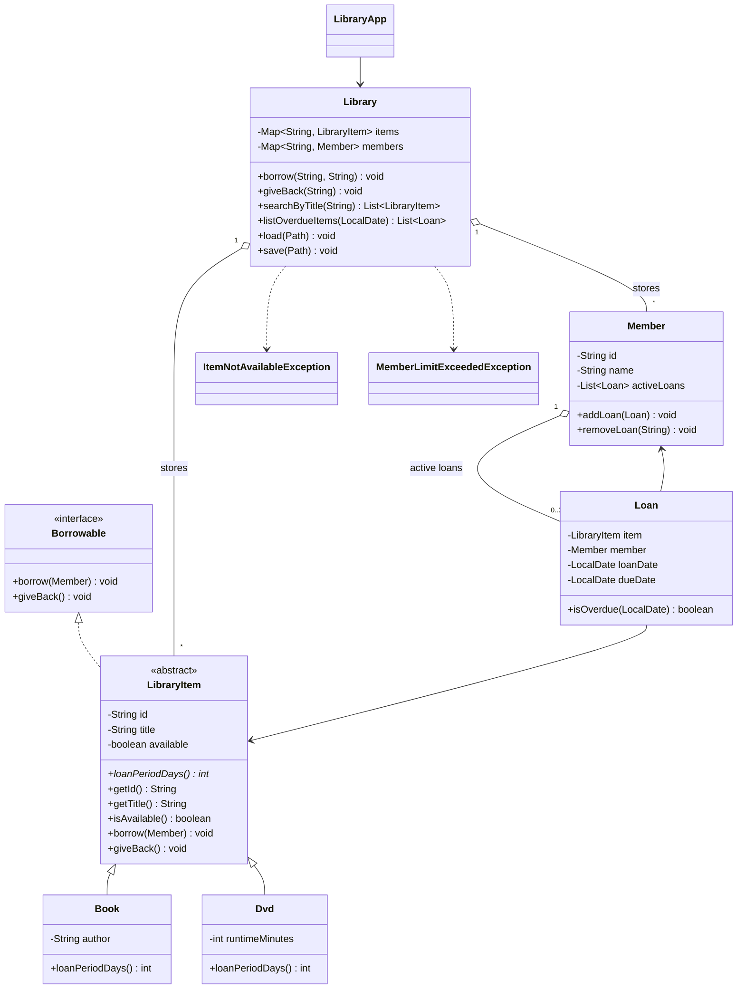

# Class Diagram

```mermaid
classDiagram
    class Borrowable {
        <<interface>>
        +borrow(Member) void
        +giveBack() void
    }
    class LibraryItem {
        <<abstract>>
        -String id
        -String title
        -boolean available
        +loanPeriodDays()* int
        +getId() String
        +getTitle() String
        +isAvailable() boolean
        +borrow(Member) void
        +giveBack() void
    }
    class Book {
        -String author
        +loanPeriodDays() int
    }
    class Dvd {
        -int runtimeMinutes
        +loanPeriodDays() int
    }
    class Member {
        -String id
        -String name
        -List~Loan~ activeLoans
        +addLoan(Loan) void
        +removeLoan(String) void
    }
    class Loan {
        -LibraryItem item
        -Member member
        -LocalDate loanDate
        -LocalDate dueDate
        +isOverdue(LocalDate) boolean
    }
    class Library {
        -Map~String, LibraryItem~ items
        -Map~String, Member~ members
        +borrow(String, String) void
        +giveBack(String) void
        +searchByTitle(String) List~LibraryItem~
        +listOverdueItems(LocalDate) List~Loan~
        +load(Path) void
        +save(Path) void
    }
    class ItemNotAvailableException
    class MemberLimitExceededException
    class LibraryApp

    Borrowable <|.. LibraryItem
    LibraryItem <|-- Book
    LibraryItem <|-- Dvd
    Library "1" o-- "*" LibraryItem : stores
    Library "1" o-- "*" Member : stores
    Member "1" o-- "0..3" Loan : active loans
    Loan --> LibraryItem
    Loan --> Member
    Library ..> ItemNotAvailableException
    Library ..> MemberLimitExceededException
    LibraryApp --> Library
```

`*` on `loanPeriodDays()` denotes an abstract operation.
